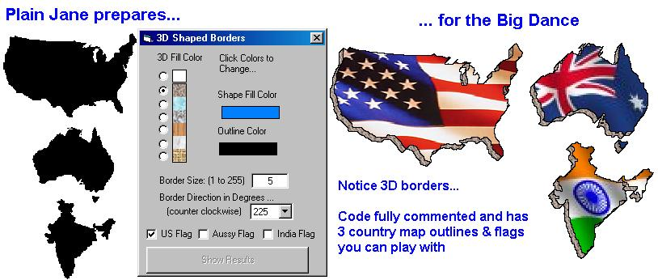



## FYI: 3D Shapes Using Regions

### Description

Create a cool 3D shape from a 2D region. See screenshot which pretty much says it all. The direction of the 3D shape is hardcoded at 45deg angles. If you choose, you can modify to allow any angle. Updated to include sample of blt'ing an image over the plain shape.
 
### More Info
 

             |
---                |---
**Submitted On**   |2005-02-13 14:27:22
**By**             |[LaVolpe](https://github.com/Planet-Source-Code/PSCIndex/blob/master/ByAuthor/lavolpe.md)
**Level**          |Intermediate
**User Rating**    |5.0 (90 globes from 18 users)
**Compatibility**  |VB 6\.0
**Category**       |[Graphics](https://github.com/Planet-Source-Code/PSCIndex/blob/master/ByCategory/graphics__1-46.md)
**World**          |[Visual Basic](https://github.com/Planet-Source-Code/PSCIndex/blob/master/ByWorld/visual-basic.md)
**Archive File**   |[FYI\_\_3D\_Sh1852352132005\.zip](https://github.com/Planet-Source-Code/lavolpe-fyi-3d-shapes-using-regions__1-58678/archive/master.zip)

